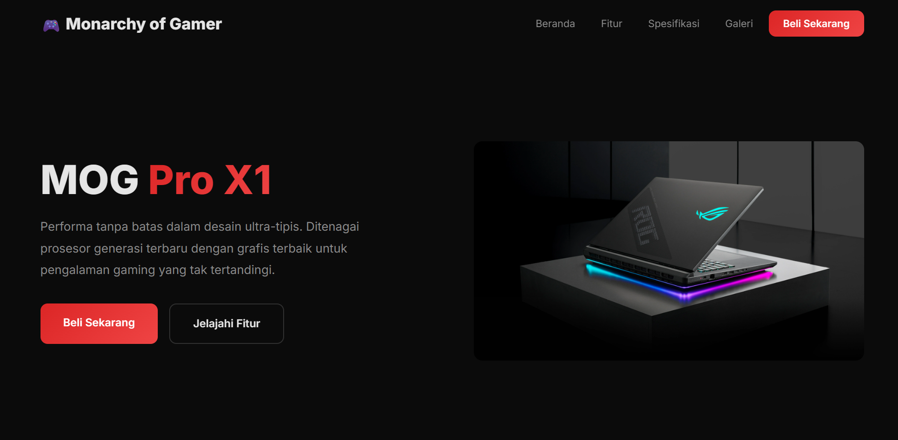
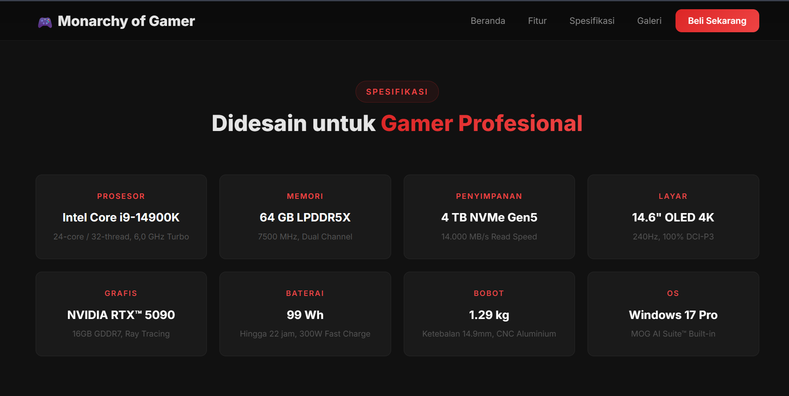

# 🎮 MOG Pro X1 - Landing Page

Landing page produk untuk laptop gaming **MOG Pro X1** dari brand *Monarchy of Gamer (MOG)*. Menampilkan fitur unggulan, spesifikasi teknis, galeri produk, dan pilihan paket pembelian dalam satu halaman yang responsif.

🔗 **Live Demo:** [laptopkeren.vercel.app](https://laptopkeren.vercel.app/)

## 📸 Preview




## ✨ Fitur

- **Hero Section** — perkenalan produk dengan tampilan visual utama
- **Fitur Unggulan** - 6 poin keunggulan produk (layar OLED 4K, prosesor cepat, desain tipis, baterai tahan lama, keamanan biometrik, WiFi 7 & 5G)
- **Spesifikasi Lengkap** - tabel detail prosesor, memori, penyimpanan, layar, grafis, baterai, bobot, dan OS
- **Galeri Produk** - kumpulan gambar dari berbagai sudut
- **Pilihan Paket** - dua varian produk (MOG X1 & MOG Pro X1) lengkap dengan harga dan spesifikasi
- **Desain Responsif** - tampilan menyesuaikan berbagai ukuran layar

## 🛠️ Teknologi yang Digunakan

- **HTML5** - struktur halaman
- **CSS3** - styling dan layout
- **JavaScript** - interaktivitas halaman
- **Vercel** - hosting & deployment

## 📁 Struktur Project

```
laptopkeren/
├── index.html
├── style.css
├── script.js
└── Images/
    └── (gambar-gambar produk)
```

## 🌐 Deployment

Website ini di-deploy menggunakan [Vercel](https://vercel.com/). Setiap perubahan yang di-push ke branch utama akan otomatis ter-deploy ulang.

## 👤 Author

Dibuat oleh **Rafi Rangga Pratama**

- GitHub: [@RaffStillTry](https://github.com/RaffStillTry)

## 📄 Lisensi

Project ini dibuat untuk keperluan pembelajaran.
